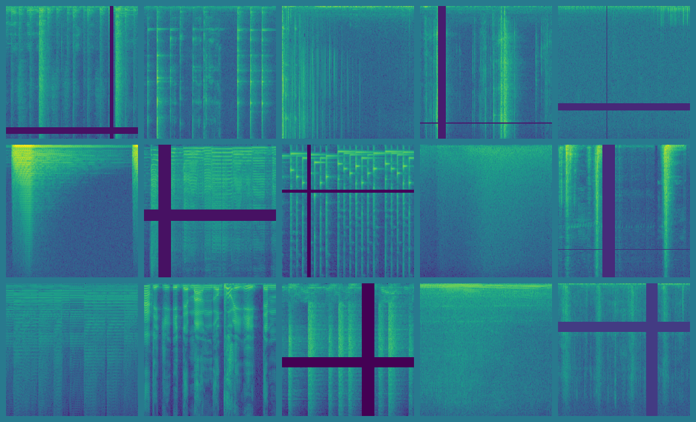

# fsd50k-pytorch

(Unofficial) Implementation of [FSD50K](https://arxiv.org/pdf/2010.00475.pdf) [1] baselines for pytorch using [pytorch-lightning](https://github.com/PyTorchLightning/pytorch-lightning)    



## About
FSD50K is a human-labelled dataset for sound event recognition, with labels spanning the AudioSet [2] ontology.  
Although AudioSet is significantly larger, their `balanced subset` which has sufficiently good labelling accuracy is smaller and is difficult to acquire since the official release only contains Youtube video ids.  
More information on FSD50K can be found in the [paper](https://arxiv.org/pdf/2010.00475.pdf) and the [dataset page](http://doi.org/10.5281/zenodo.4060432).

## Keypoints
* Complete recipe for training `VGG-like` and `ResNet18` baselines as given in the FSD50K paper.
* Includes preprocessing steps following the paper's experimentation protocol, including patching methodology (*Section 5.B*)
* Support for both spectrograms and melspectrogram features (just change "feature" under "audio_config" in cfg file)
* *melspectrogram* setting has the *exact* parameters as given in the paper, *spectrogram* can be configured
* FP16, multi-gpu support

## Differences v/s the paper
* SpecAugment, Background noise injection were used during training
* As opposed to the paper, Batch sizes`> 64` were used for optimal GPU utilization.
* For faster training, pytorch defaults for the Adam optimizer were used.  
  Learning rates given in the paper are much lower and will require you to train for much longer.  
* Per instance Zero-centering was used

## Results
| Model | features | cfg | Official [1] <br> mAP, d' | This Repo <br> mAP, d' | Link |
| ----- | ----- | ----- | ----- | ----- | ----- |
|       |       |       |       |       |       |
| Resnet18 | melspectrograms | resnet_chunks_melspec.cfg | 0.373, 1.883 | 0.400, 1.905 | [checkpoint](https://drive.google.com/drive/folders/1kCeth1dXAGa5tGJs1sEOXyWgH5nRunFy?usp=sharing) |
| VGG-like | melspectrograms | vgglike_chunks_melspec.cfg | 0.434, 2.167 | 0.408, 2.055 | [checkpoint](https://drive.google.com/drive/folders/16lroxqjHoc4-8sbC0y7aZrStQ7cZOs65?usp=sharing) |
| Resnet18 | spectrograms <br> (length=0.02 ms, stride=0.01 ms) | resnet_chunks.cfg | - | 0.420, 1.946 | [checkpoint](https://drive.google.com/drive/folders/14hOggY4N4ZDcSaCBBVCtcN6zNwvIJC7O?usp=sharing) |
| VGG-like | spectrograms <br> (length=0.02 ms, stride=0.01 ms) | vgglike_melspec.cfg | - | 0.388, 2.021 | [checkpoint](https://drive.google.com/drive/folders/14e8B6u5Jshi4ku2IXlDdrL6cQ2bmLGbs?usp=sharing) |

## Requirements
* `torch==1.7.1` and corresponding `torchaudio` from [official pytorch](https://pytorch.org/get-started/locally/)
* `libsndfile-dev` from OS repos, for 'SoundFile==0.10.3'
* `requirements.txt`

## Procedure
1. Download [FSD50K](http://doi.org/10.5281/zenodo.4060432) dataset and extract files, separating `dev` and `eval` files into different subdirectories.
2. Preprocessing 
    1. `multiproc_resample.py` to convert sample rate of audio files to 22050 Hz
       ```
       python multiproc_resample.py --src_path <path_to_dev> --tgt_path <path_to_dev_22050>
       python multiproc_resample.py --src_path <path_to_eval> --tgt_path <path_to_eval_22050>
       ```
    2. `chunkify_fsd50k.py` to make chunks from dev and eval files as per *Section 5.B* of the paper. One can do this on the fly as well.
        ```
        python chunkify_fsd50k.py --src_dir <path_to_dev_22050> --tgt_dir <path_to_dev_22050_chunks>
        python chunkify_fsd50k.py --src_dir <path_to_eval_22050> --tgt_dir <path_to_eval_22050_chunks>
        ```
    3. `make_chunks_manifests.py` to make manifest files used for training.
        ```
        python make_chunks_manifests.py --dev_csv <FSD50k_DIR/FSD50K.ground_truth/dev.csv> --eval_csv <FSD50k_DIR/FSD50K.ground_truth/eval.csv> \
                                        --dev_chunks_dir <path_to_dev_22050_chunks> --eval_chunks_dir <path_to_eval_22050_chunks> \
                                        --output_dir <chunks_meta_dir>
        ```
       This will store absolute file paths in the generated tr, val and eval csv files.
3. The `noise` subset of the [Musan Corpus](https://openslr.org/17/)  [Musan Corpus] is used for background noise augmentation.  Extract all `noise` files into a single directory and resample them to 22050 Hz. Background noise augmentation can be switched off by removing `bg_files` entry in the model cfg.
4. Training and validation
    1. For ResNet18 baseline, run
       ```
       python train_fsd50k_chunks.py --cfg_file ./cfgs/resnet18_chunks_melspec.cfg -e <EXP_ROOT/resnet18_adam_256_bg_aug_melspec> --epochs 100
       ```
    2. For VGG-like, run
       ```
       python train_fsd50k_chunks.py --cfg_file ./cfgs/vgglike_chunks_melspec.cfg -e <EXP_ROOT/vgglike_adam_256_bg_aug_melspec> --epochs 100
       ```
4. Evaluation on Evaluation set
    ```
    python eval_fsd50k.py --ckpt_path <path to .ckpt file> --eval_csv <chunks_meta_dir/eval.csv> --lbl_map <chunks_meta_dir/lbl_map.json>
    ```

## Some ideas for improving performance
* Try more augmentations, such as Random Resized cropping
* Try weighted BinaryCrossEntropy to help with the significant label imbalance.
* Use Focal loss [2] instead of BinaryCrossEntropy

## References
[1] Fonseca, E., Favory, X., Pons, J., Font, F. and Serra, X., 2020. FSD50k: an open dataset of human-labeled sound events. arXiv preprint arXiv:2010.00475.  
[2] Gemmeke, J.F., Ellis, D.P., Freedman, D., Jansen, A., Lawrence, W., Moore, R.C., Plakal, M. and Ritter, M., 2017, March. Audio set: An ontology and human-labeled dataset for audio events. In 2017 IEEE International Conference on Acoustics, Speech and Signal Processing (ICASSP) (pp. 776-780). IEEE.  
[3] Lin, T.Y., Goyal, P., Girshick, R., He, K. and Dollár, P., 2017. Focal loss for dense object detection. In Proceedings of the IEEE international conference on computer vision (pp. 2980-2988).

## Acknowledgements

Thanks to implementations 